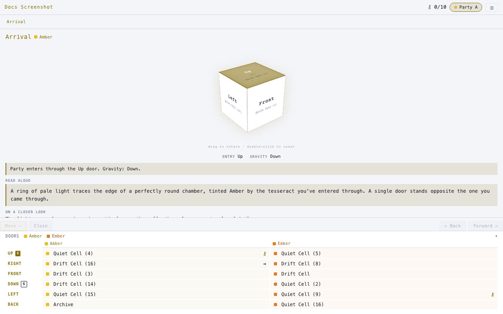
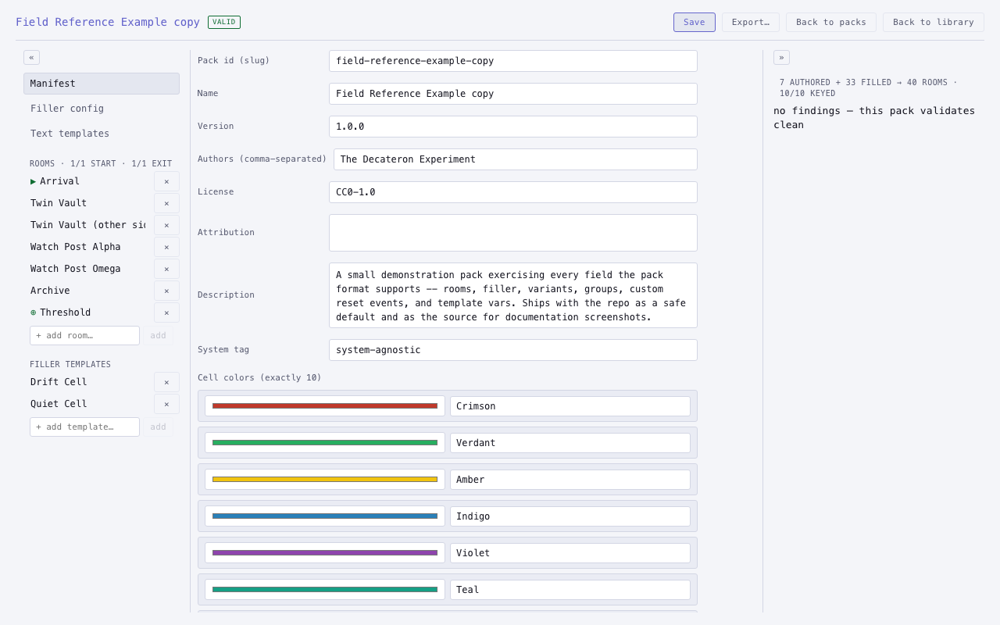

# The Decateron Experiment

A behind-the-GM-screen tool for running a tabletop dungeon shaped like a **5-cube**
(a penteract).

Ten tesseracts, forty rooms, and every room stands in two tesseracts at once. Open a
door and the GM (or chance) decides which of the two you walk through — so the same
room has different exits depending on how you reached it, and the players cannot map
it. The tesseract's colour is the in-fiction tell.

Runs entirely in your browser. No server, no account, no network connection required,
nothing leaves your machine.

**[▶ Run it now — no install](https://thedecateronexperiment.com/)** ·
[View on GitHub](https://github.com/sheabrennan/TheDecateronExperiment)

Both screenshots are from **Field Reference Example**, the small original pack bundled
with the repo — safe to show publicly, and a good one to poke at while building your
own (see [pack builder guide](pack-builder/index.md)).

## Where to go next

- **New to the app?** Start with the [Quickstart](quickstart.md) — generate a
  dungeon and run your first room in under five minutes.
- **Running a session?** [Using the app](using-the-app.md) walks through every
  screen: the room panel, doors, party splits, saves.
- **Building your own dungeon?** The [pack builder guide](pack-builder/index.md)
  covers authoring, importing, and validating packs, and the
  [field reference](pack-builder/reference.md) documents every field a pack
  `.json` can declare.
- **Contributing or self-hosting?** See
  [running from source](dev/running-from-source.md) and the
  [architecture notes](dev/architecture.md).

## Support this project

This project is, and will stay, free and open source. If it's useful to you:

- ☕ **[Support on Ko-fi](https://ko-fi.com/isshea)** — one place for a one-off tip, a
  purchase, or a small monthly subscription. Subscribers get a ready-to-play,
  SRD-safe buildpack (no authoring required) and a vote on what gets built next: a
  6-cube version, tighter VTT integrations, map service hookups, and whatever else
  people actually want. Cancel any time — the framework and the bundled example pack
  are always free here on GitHub.
